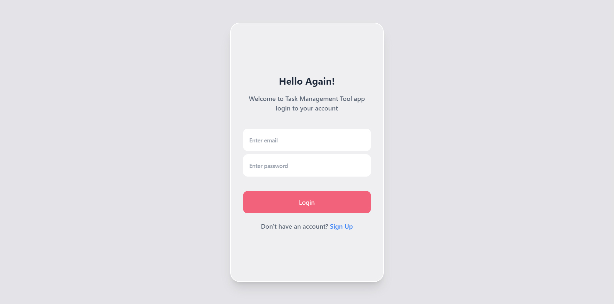
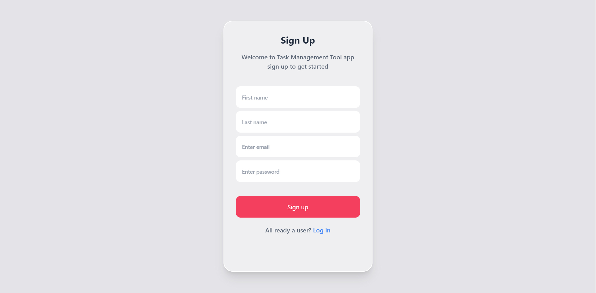
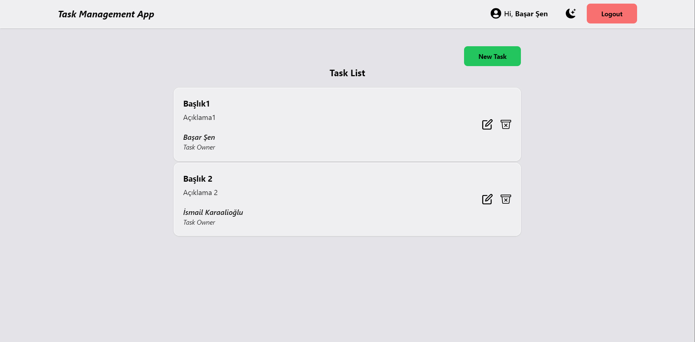
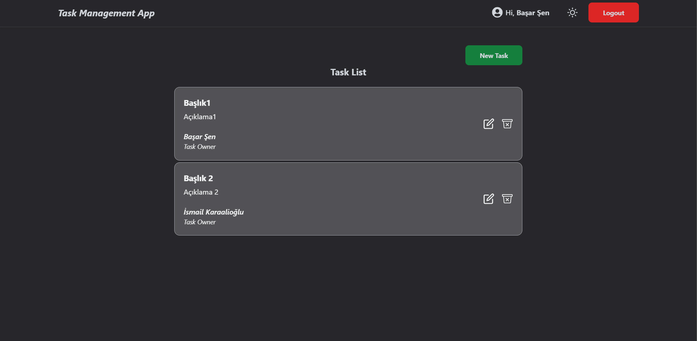
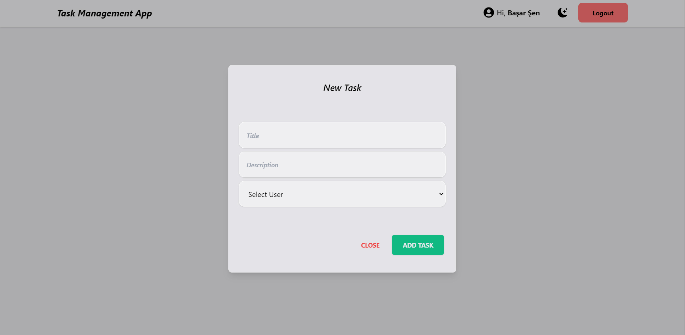
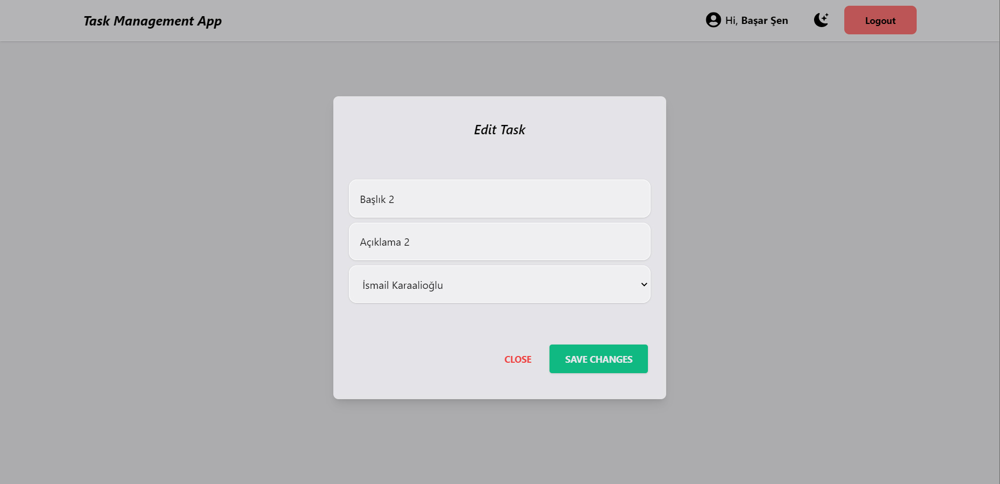

# Task Management Application with React

## :computer: Setup

1. Clone the repository and install its features.

```
npm install or yarn install
```

2. Create .env and add the follow key.

```
add project .env file and the follow key (REACT_APP_ENDPOINT=api)
```

3. Use the project locally (localhost).

```
npm start or yarn start
```

## :fire: Technologies and Libraries

:point_right: React.js <br />
:point_right: Redux <br />
:point_right: Redux Toolkit <br />
:point_right: Formik <br />
:point_right: Yup <br />
:point_right: React Router <br />
:point_right: Tailwind CSS <br />
:point_right: React-Icons <br />
:point_right: Axios <br />
:point_right: React-Hot-Toast <br />

## Screenshot






